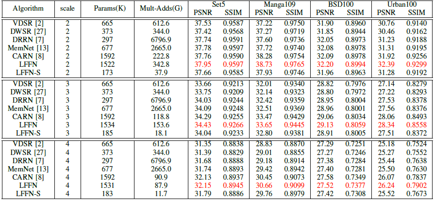
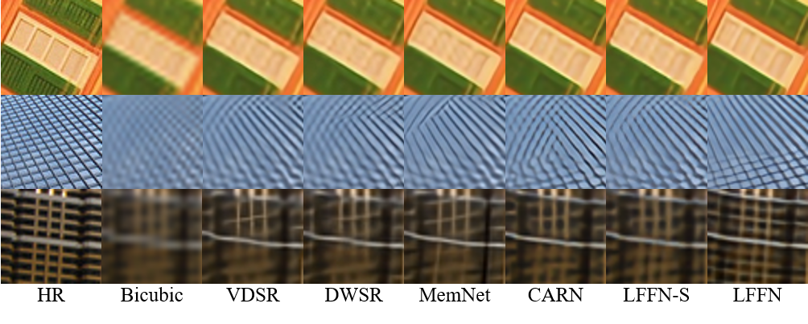

# Lightweight Feature Fusion Network for Single Image Super-Resolution
[[arXiv]](https://arxiv.org/abs/1902.05694) [[IEEE Signal Processing Letters]](https://ieeexplore.ieee.org/abstract/document/8600373)
-------------
This repository is Tensorflow code for our proposed LFFN.

The code is based on [DCSCN](https://github.com/jiny2001/dcscn-super-resolution) and [BasicSR](https://github.com/xinntao/BasicSR), and tested on Ubuntu 16.04 environment (Python 3.6, Tensorflow 1.4, CUDA 8.0) with 1080Ti GPU.

If you find our work useful in your research or publications, please consider citing:

```latex
@article{yang2019lightweight,
  title={Lightweight Feature Fusion Network for Single Image Super-Resolution},
  author={Yang, Wenming and Wang, Wei and Zhang, Xuechen and Sun, Shuifa and Liao, Qingmin},
  journal={IEEE Signal Processing Letters},
  volume={26},
  number={4},
  pages={538--542},
  year={2019},
  publisher={IEEE}
}

@article{yang2019lightweight,
  title={Lightweight Feature Fusion Network for Single Image Super-Resolution},
  author={Yang, Wenming and Wang, Wei and Zhang, Xuechen and Sun, Shuifa and Liao, Qingmin},
  journal={arXiv preprint arXiv:1902.05694},
  year={2019}
}
```

## Contents
1. [Test](#test)
2. [Results](#results)
3. [Acknowlegements](#acknowledgements)

## Test

1. Clone this repository:

   ```shell
   git clone https://github.com/qibao77/LFFN-master.git
   ```

2. Download our trained models from [BaiduYun](https://pan.baidu.com/s/13QxG0S4ErCvY81q2x6io5A)(code:en3h), place the models to `./models`. We have provided three small models (LFFN_x2_B4M4_depth_div2k/LFFN_x3_B4M4_depth_div2k/LFFN_x4_B4M4_depth_div2k) and the corresponding results in this repository.

3. Place SR benchmark (Set5, bsd100, Urban100 and Manga109) or other images to `./data/test_data/*`.

4. You can edit `./helper/args.py` according to your personal situation.

5. Then, run **following command** for evaluation:
   ```shell
   python evaluate.py
   ```

6. Finally, SR results and PSNR/SSIM values for test data are saved to `./models/*`. (PSNR/SSIM values in our paper are obtained using matlab)

## Results

#### Quantitative Results



Benchmark SISR results. Average PSNR/SSIM for scale factor x2, x3 and x4 on datasets Set5, Manga109, bsd100 and Urban100.

#### Visual Results



Visual comparison for x3 SR on “img013”, “img062”, “img085”from the Urban100 dataset.

## Acknowledgements

- Thank [DCSCN](https://github.com/jiny2001/dcscn-super-resolution). Our code structure is derived from it. 
- Thank [BasicSR](https://github.com/xinntao/BasicSR). They provide many useful codes which facilitate our work.
